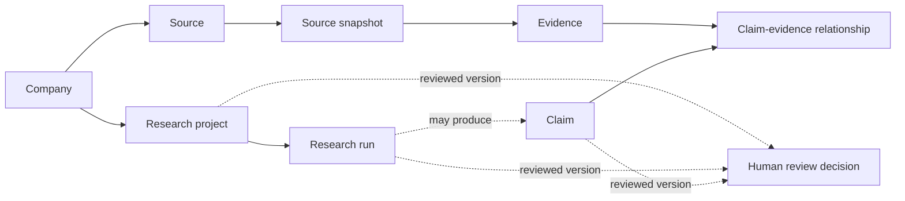

# Core domain model

## Contract boundary and version

The framework-independent Python contracts in `apps/api/src/arizonix_api/domain` are version **1.0**.
An assembled `DomainBundle` and every evaluation case declare that version. Unexpected fields are
rejected so producers cannot silently send data that consumers ignore.

Compatibility policy:

- Additive optional fields and new enum values require a minor version and consumer review.
- Removing, renaming, changing meaning, or making a field required requires a major version.
- Stored records and evaluation cases retain the version under which they were produced.
- JSON Schema is generated from the Python evaluation model and checked for drift.

The frontend does not have a duplicate hand-maintained copy. Types should later be generated from
actual versioned API contracts where they cross an API boundary.

## Relationships

These are contract references, not database foreign keys. `validate_domain_bundle` checks assembled
records in memory; future persistence also needs database constraints, workspace policies, and
application authorization.

## Implemented entities

### Company

A workspace-scoped business identity with an internal UUID, display name, optional location, website,
and deterministic identity key. Similar names are not identities. `workspace_id` makes ownership
explicit but neither the UUID nor model validation grants access.

### Research project and research run

A project describes business progression and a versioned objective. A run describes execution state:
`queued`, `running`, `paused`, `succeeded`, `failed`, or `cancelled`. They are separate because a
successful execution can validly conclude `insufficient_evidence`, `no_meaningful_problem`,
`unsuitable_business`, `stale_data`, or `human_rejected`; success does not imply an opportunity.

The contracts validate date ordering and terminal consistency but do not implement an operational
state machine, queue, retry policy, or transition authorization.

### Source and source snapshot

A source is stable identity for an official site, review platform, news page, social source, directory,
or other origin. A snapshot is one attempted capture with requested/final URLs, capture status, optional
HTTP status, capture time, and—only for successful captures—a content hash and storage reference.

Capture outcomes are `success`, `inaccessible`, and `failed`. URL parsing is syntactic validation, not
SSRF protection. Future collectors require DNS/IP controls, redirect revalidation, egress rules,
timeouts, size limits, and permitted-source policy.

Publication precision is explicit: `unknown`, `exact_timestamp`, `exact_date`, or
`approximate_period`. A date is not expanded to an invented time, and `captured_at` never fills an
unknown publication value. A later inaccessible capture does not erase an auditable historical
snapshot.

### Evidence

Evidence is an inspectable observation tied to one snapshot. Internal UUIDs are separate from readable
labels such as `EV-001`. Types distinguish direct observations, exact excerpts, structured records,
and attributed statements. An exact excerpt can retain selector or offset information.

Freshness (`unknown`, `current`, `recent`, `historical`, `stale`) is separate from optional heuristic
strength (`weak`, `moderate`, `strong`) and source reliability. There is no default high score. Evidence
stores an observation; an inference belongs in a claim.

### Claim and claim-evidence relationship

A claim is a versioned statement. Lifecycle status (`draft`, `under_review`, `verified`, `rejected`,
`invalidated`) is independent from evidentiary classification (`fact`, `signal`, `inference`,
`hypothesis`, `historical`, `stale`, `invalid`). This intentionally separates workflow from meaning.

Support, contradiction, and ambiguous relevance are explicit relationship records bound to a claim
version. An unassessed hypothesis may have no evidence. A verified claim must have at least one support
reference, and one evidence item cannot be both support and contradiction for the same claim version.
Those structural rules do not prove truth; substantive source independence and verification arrive
later. No confidence formula is implemented.

### Human-review decision

A decision records actor, research or outbound scope, artifact type and UUID, exact artifact version,
decision, timestamp, and optional explanation. Research approval and outbound-message approval are
separate. The outbound artifact type reserves a boundary; there is no message or send implementation.

## Identifiers, ownership, nulls, and time

- Internal IDs are UUIDs. Human labels never serve as references.
- Every implemented record carries `workspace_id`; company-owned records also carry `company_id`.
- References must stay within both ownership dimensions when records are assembled.
- All timestamps require timezone offsets. Unknown values remain `null` rather than guessed.
- Approximate periods remain text with explicit precision; dates and periods are not promoted to exact
  timestamps.
- Versioned claims and review artifacts make later edits distinguishable from reviewed content.

## Vocabulary mapping

The available Step 1.3 brief uses fact, signal, inference, hypothesis, historical, stale, and invalid
information. These map to `EvidentiaryClassification`. Verified/rejected/invalidated describe claim
lifecycle instead. Availability belongs to snapshot capture status; temporal validity belongs to
publication precision and evidence freshness; evidence strength is a separate optional heuristic.

This split is intentional: one overloaded status could otherwise claim that a reachable page is fresh,
that a recent item is strong, or that a reviewed claim is true.

The full numbered project proposal is not present in the repository. Exact proposal-vocabulary mapping
remains pending until the authoritative source is added at `docs/project-proposal.md`.

## Validation boundary

Pydantic establishes shape, types, ranges, temporal precision, and local invariants. The bundle
validator establishes referential and ownership consistency for assembled records. Neither performs
authorization, network safety checks, source trust assessment, independent corroboration, substantive
claim verification, or database integrity enforcement.

## Deferred contracts

People and decision-makers, customer reviews as normalized business objects, processes, pain points,
opportunities, capabilities, solutions, financial assumptions, retrieval indexes, usage/budget records,
outbound messages, suppression, delivery, and response tracking remain documented future concepts.
They should become contracts only when their implementation step can validate real invariants.
